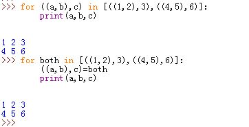
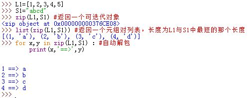
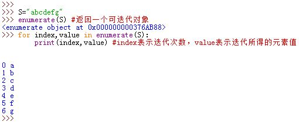

# `while`、`for`循环
1.`while`语句格式：

```
	while test_expr:
		statement1
	else:#可选
		statement2
```
* `while`和`else`缩进必须一致。
* `else`可选。`else`子句在控制权离开循环且未碰到`break`语句时执行。即在正常离开循环时执行（`break`是非正常离开循环）
* 在`while`子句中可以使用下列语句：
	* `break`：跳出最近所在的循环到循环外部
	* `continute`：跳过本次循环后续部分，直接掉转到下一轮循环起始处
	* `pass`：占位符，什么都不做
		>在Python3中，允许在使用表达式的地方使用`...`代表，
		>这是`pass`语句的一种替代方案。它表示代码随后填充，是未确定的内容  

  

2.`for`语句格式：

```
	for target_var in iter_obj:
		statement1
	else:#可选
		statement2
```
* `for`和`else`缩进必须一致。
* `else`可选。`else`子句在控制权离开循环且未碰到`break`语句时执行。即在正常离开循环时执行（`break`是非正常离开循环）
* 在`for`子句中可以使用`break`、`continute`、`pass`语句
* `target_var`是赋值目标，`iter_obj`是任何可迭代对象。每一轮迭代时将迭代获得的值赋值给`target_var`，然后执行`statement1`
>任何赋值目标在语法上均有效，即使是嵌套的结构也能自动解包：
>
	```
	for ((a,b),c) in [((1,2),3),((4,5),6)]:#自动解包
		print(a,b,c)
	```
>当然你也可以手动解包：
>
	```
	for both in [((1,2),3),((4,5),6)]:#自动解包
		((a,b),c)=both
		print(a,b,c)
	```

  

3.`for`扫描文件时，直接使用文件对象迭代，每次迭代时读取一行，执行速度快，占用内存少：

```
for line in open('test.txt'):
	print(line)
```

4.`for`语句通常比对应的`while`语句执行速度快

5.Python3中，`range()`返回一个迭代器对象。用法为：`range(0,10,2)`，其中`0`为起始数，`10`为终止数（不包含），`2`为步长。默认步长为1，起始为0.
>Python2中，`range()`返回一个列表对象

* 要得到列表，用`list(range(0,10,2))`
* 通常`range()`用于`for`循环：

	```
	S="abcdefg"
	for i in range(0,len(S),2):
		print(S[i],end=" "）
	```
  它也等价于下列循环：

  ```
	S="abcdefg"
	for c in S[::2]
		print(c,end=" ")
  ```
  用range()优点是它并未复制字符串			
* 当我们遍历列表且对其进行修改时，要用到`range()`和`len()`组合。直接用`for`遍历列表不能修改列表，因为`for x in L：`遍历的是列表元素，不是列表中元素的位置。  
  

6.Python3中，`zip()`函数返回一个迭代器对象。
>Python2中，`zip()`返回一个元组对的列表

* `list(zip(L1,L2))`创建一个列表，列表元素为元组对，元组对的第一个元素来自于`L1`，第二个元素来自于`L2`，列表长度为`L1`与`L2`的最小值
* `zip()`可以有两个以上的参数，且这些参数可以是任意的可迭代对象
* 可以在循环中用自动列表解包：

  ```
	for x,y,z in zip(iter_obj1,iter_obj2,iter_obj3):
		pass
  ```
  

7.Python3中，`map()`函数生成一个可迭代对象，用法为：`map(func,iter_obj)`。每一次迭代则在迭代得到的元素上应用函数`func`。
>Python2中，`map()`执行的是另一种语意

  

8.`enumerate()`函数生成一个可迭代对象，用法为：`enumerate(iter_obj)`。每一次迭代生成一个`(index,value)`元组，`index`表示迭代次数，从0开始计数，`value`代表迭代获得的元素值。

 


