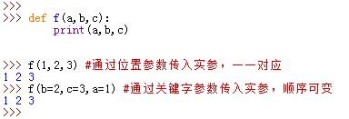
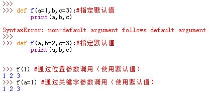
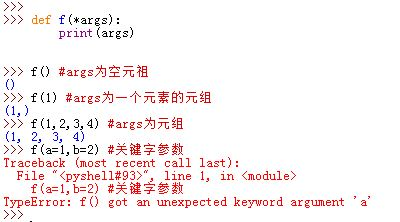

# 参数
1.参数传递的性质：

* 参数的传递是通过自动将对象赋值给本地变量名来实现的（自动的隐式赋值）
	>被传递的参数对象本身并不会被拷贝
* 在函数内部的参数名赋值不会影响到实参对象，只是将变量名重新引用到另一个对象
* 若实参对象为可变对象，则在函数内原地修改参数对象会影响所有的指向该实参对象的引用
	>可变参数实参对象对函数来说，既可以作为输入也可以作为输出
	>
	>如果想限制对可变实参对象的修改，可以创建一个可变对象的拷贝作为参数；
	>或者直接转换成不可变对象作为参数

  

2.默认情况下，参数匹配是通过其位置进行匹配的，从左到右一一匹配。必须精确传递和函数签名中参数名一样多的实参。

3.关键字参数：允许通过变量名进行匹配，而不是通过位置。其中关键字顺序可以任意。   
  

4.默认参数：函数定义时，可以为参数设定默认值，这样允许调用时传递较少的参数。
>对于默认实参，可以不用给它传入实参

* 默认实参后面不能跟随非默认实参。如果出现这种情况则报语法错误。  
 

5.可变参数：

* 函数能用特定的参数（以`*`开头），收集任意多的额外位置参数，将收集到的位置相关的参数到一个新元组中。
	>若出现了额外的关键字参数，则报错

    
* 函数能用特定的参数（以`**`开头），收集任意多的额外关键字参数，将收集关键字相关的参数到一个新字典中。
	>若出现了额外的位置参数，则报错

    

6.可变参数解包：

* 调用者可以用`*`语法将实参（如元组、列表、`set`）打散，形成位置参数
* 调用者可以用`**`语法将字典实参打散，形成关键字参数  
>这里的`*`和`**`均是在函数调用中出现，而不是在函数定义中出现

    

7.`keyword-only`参数：在Python3中，它是一种命名参数，出现在`*`参数之后，在`**`参数之前。所有的`keyword-only`参数必须使用关键字语法传递。
>如果不这么做，则没有办法传递该实参

    

8.函数调用时，位置参数与关键字参数可以组合

* 不能为同一个形参同时指定位置实参与关键字实参
* 任何关键字实参必须位于任何位置实参之后  
  

9.函数定义时的参数类型顺序：

```
def func(a,b,c='c',*d,e,f='f',**g):
	pass
# a,b:为一般参数
# c:指定了默认实参
# d:为可变位置参数
# e,f:为 keyword-only参数，其中f指定了默认参数
# g:为可变关键字参数
```
* 调用时必须先赋值形参`c`，才能进入`d`。无法跳过`c`去赋值`d`
* `e,f,g`调用时必须都是关键字实参

10.函数调用时实参类型顺序：

```
func('a','b',e='e',*seq,**dic)
#seq是一个序列，它解包之后优先覆盖c，剩下的再收集成元组传给d
#dic是一个字典，它解包之后优先考虑e,f，剩下的在收集成字典传递给g
#e='e'这个关键字实参也可以位于'b'之后的任何位置
#关键字实参必须位于位置实参之后
```
  

* 通过位置分配位置参数
* 通过匹配变量名在分配关键字参数
* 额外的非关键字参数分配到 `d`引用的元组中
* 额外的关键字参数分配到`g`引用的字典中
* 默认值分配给剩下未赋值的参数

Python最后检测确保每一个参数只传入了一个值

11.定义函数时，形参列表中`*`可以单独出现。此时函数并不表示接受一个可变长度的实参列表，而是表示`*`后面的所有实参必须作为关键字实参传入：
>并不能用`**`像`*`一样单独出现在函数定义中。 
 
  


