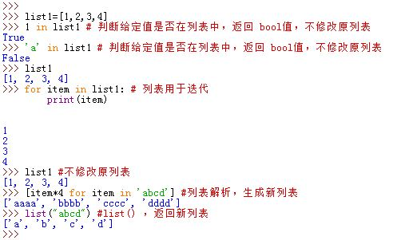
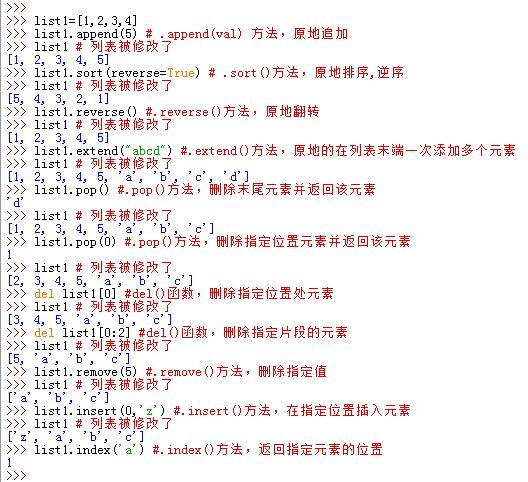
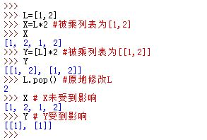
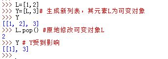

# 列表

1.列表可以包含任何种类的对象。它是本身是一种可变对象，支持原地修改。
> 不可变对象有元组、字符串、`frozenset`

2.列表的基本操作有：

* `list1+list2`：列表相加合并生成新的列表，<font color="red">
  并不会修改`list1`和`list2`的值</font>
* `list1*5`： 列表乘以数字生成重复的新列表，<font color="red">
  并不会修改`list1`的值</font>  
   
* `item in list1`： 返回元素`item`是否在列表`list1`中 
* 用于迭代，<font color="red">并不会修改`list1`的值</font>：

	```
	for item in list1:
		pass
	```
* 列表解析： `[item*4 for item in iter_obj]`
* `list()`函数：`list(iter_obj)`生成新列表  
  

* 索引和分片：
	* `list1[index]`：索引，获取指定偏移处的对象，<font color="red">
  	  并不会修改`list1`的值</font>
	* `list1[index1:index2]`：分片，返回一个新列表，
	   其元素值与旧列表对应片段处元素值相等，<font color="red">
  	   并不会修改`list1`的值</font>
	* 当索引位于赋值左侧时，则是索引赋值。这会改变列表指定项的内容。
	  <font color="red">修改`list1`的值</font>
	* 当分片位于赋值左侧时，则是分片赋值。这会改变列表指定片段的内容。
	  <font color="red">修改`list1`的值</font>
		>被赋值的片断长度不一定要与赋值的片断长度相等

	

3.列表的方法调用有：

* `.append(val)`方法：在列表之后追加元素，<font color="red">原地修改</font>
* `.sort(key=None, reverse=False)`方法：对列表进行排序，
   <font color="red">原地修改</font>
	* `key`为一个排序方法
	* `reverse`为是否逆序
* `.reverse()`方法：原地翻转列表，<font color="red">原地修改</font>
* `.extend(iter_obj)`方法：在列表末端插入多个元素，<font color="red">原地修改</font>
* `.pop()`方法：删除末尾元素并返回该元素，<font color="red">原地修改</font>
	* `.pop(index)`方法：删除指定位置元素并返回该元素，
	  <font color="red">原地修改</font>
* `del list1[0]`函数：删除指定位置处元素，<font color="red">原地修改</font>
	>与`.pop()`的区别在于`del()`函数并不返回该元素
* `del list1[index1:index2]`函数：删除指定片断处元素，
   <font color="red">原地修改</font>
* `.remove(val)`：通过值删除元素，**若有多个值，则只删除第一个遇到的值**
   <font color="red">原地修改</font>
* `.insert(index,val)`：在指定位置插入元素，<font color="red">原地修改</font>
* `.index(val)`：返回指定元素的位置，**若有多个值，则只返回第一个遇到的值所在位置**

  
  

4.列表相关的内置函数：

* `sorted(list1,key=None,reverse=False)`：排序列表并返回新列表，
   <font color="red">非原地修改</font>
* `reversed(list1)`：返回迭代器，该迭代器迭代结果就是列表的逆序  
  

5.列表不允许引用超出列表末尾的索引。  


6.列表解析表达式：通过对可迭代对象迭代生成的项运行一个表达式的方式创建一个新列表。如：
`[c*2 for c in "apple"]`

7.`list(iter_obj)`可以通过可迭代对象`iter_obj`生成一个新列表

8.假设`L=[1,2]`，注意下面的用法的区别：

* `X=L*2`：列表乘以整数，生成新列表`[1,2,1,2]`
* `Y=[L]*2`：也是列表乘以整数，但是被乘列表是`[[1,2],]`，
  生成的新列表是`[[1,2],[1,2],]`
>列表元素为可变对象时注意，这里改变`L`会影响`Y`，因为`Y`持有`L`的引用

  

9.如果列表的元素是可变对象的，则对该可变对象的修改会影响到列表。  


